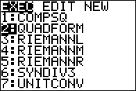
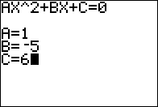
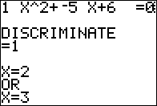

# TI Programs

Scripts for TI-83 series and TI-84 Plus series graphing calculators

## Preview

Quadratic formula

  

## Installation

1. Download and install [TI Connect™ CE](https://education.ti.com/en/products/computer-software/ti-connect-ce-sw)

2. Download and unzip [TI Programs](https://github.com/yehwankim23/ti-programs/releases/latest/download/ti-programs.zip)

3. Turn on the calculator and connect it to the computer

4. Run `TI Connect™ CE` and select `Actions` > `Add Files from Computer... (Ctrl+M)`

5. Select scripts that you want to install and click `Open`

   - `COMPSQ`: Completing the square
   - `QUADFORM`: Quadratic formula
   - `RIEMANNL`: Riemann sum (left)
   - `RIEMANNM`: Riemann sum (middle)
   - `RIEMANNR`: Riemann sum (right)
   - `SYNDIV3`: Synthetic division degree 3
   - `UNITCONV`: Unit converter

6. (Optional) Select `NAME ON CALCULATOR` > `Custom` and change names

7. Select the calculator under `DESTINATION CALCULATORS`

8. Click `Send` and wait until the green progess bar disappears

9. Disconnect the calculator from the computer

## Usage

- Press `PRGM`, highlight a script, and press `ENTER` twice
- When the result is displayed, press `ENTER` to go to Home

### Riemann sum

- Press `Y=` and enter the equation in `Y1` before you run the script
